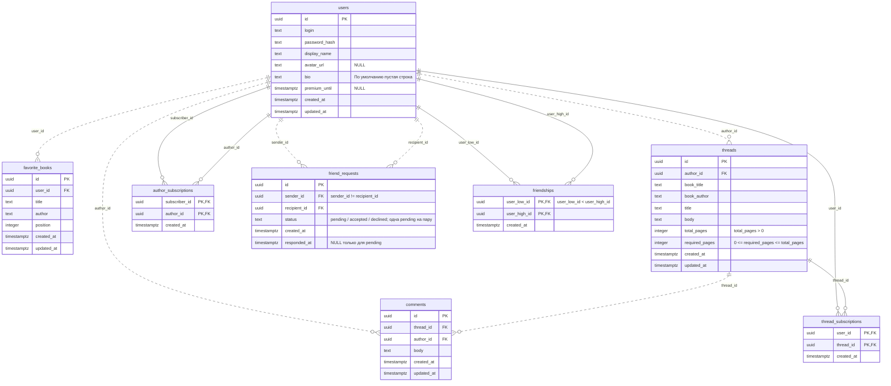

```mermaid
erDiagram
    direction TB

    users {
        uuid id PK
        text login
        text password_hash
        text display_name
        text avatar_url "NULL"
        text bio "По умолчанию пустая строка"
        timestamptz premium_until "NULL"
        timestamptz created_at
        timestamptz updated_at
    }

    favorite_books {
        uuid id PK
        uuid user_id FK
        text title
        text author
        integer position
        timestamptz created_at
        timestamptz updated_at
    }

    threads {
        uuid id PK
        uuid author_id FK
        text book_title
        text book_author
        text title
        text body
        integer total_pages "total_pages > 0"
        integer required_pages "0 <= required_pages <= total_pages"
        timestamptz created_at
        timestamptz updated_at
    }

    comments {
        uuid id PK
        uuid thread_id FK
        uuid author_id FK
        text body
        timestamptz created_at
        timestamptz updated_at
    }

    thread_subscriptions {
        uuid user_id PK, FK
        uuid thread_id PK, FK
        timestamptz created_at
    }

    author_subscriptions {
        uuid subscriber_id PK, FK
        uuid author_id PK, FK
        timestamptz created_at
    }

    friend_requests {
        uuid id PK
        uuid sender_id FK "sender_id != recipient_id"
        uuid recipient_id FK
        text status "pending / accepted / declined; одна pending на пару"
        timestamptz created_at
        timestamptz responded_at "NULL только для pending"
    }

    friendships {
        uuid user_low_id PK, FK "user_low_id < user_high_id"
        uuid user_high_id PK, FK
        timestamptz created_at
    }

    users ||..o{ favorite_books : "user_id"
    users ||..o{ threads : "author_id"
    users ||..o{ comments : "author_id"
    threads ||..o{ comments : "thread_id"
    users ||--o{ thread_subscriptions : "user_id"
    threads ||--o{ thread_subscriptions : "thread_id"
    users ||--o{ author_subscriptions : "subscriber_id"
    users ||--o{ author_subscriptions : "author_id"
    users ||..o{ friend_requests : "sender_id"
    users ||..o{ friend_requests : "recipient_id"
    users ||--o{ friendships : "user_low_id"
    users ||--o{ friendships : "user_high_id"
```
